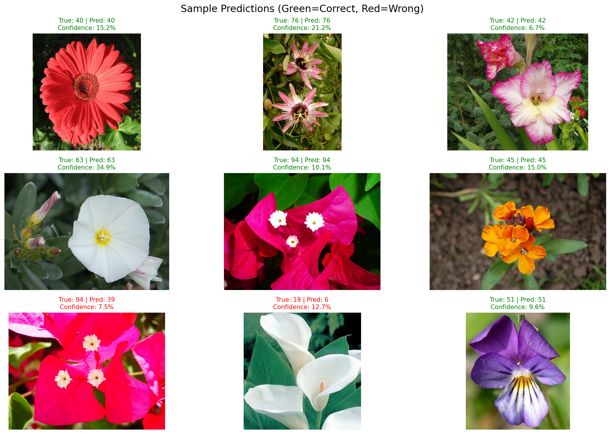
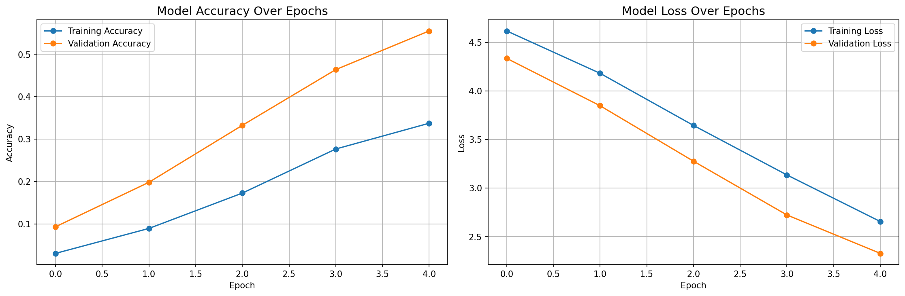
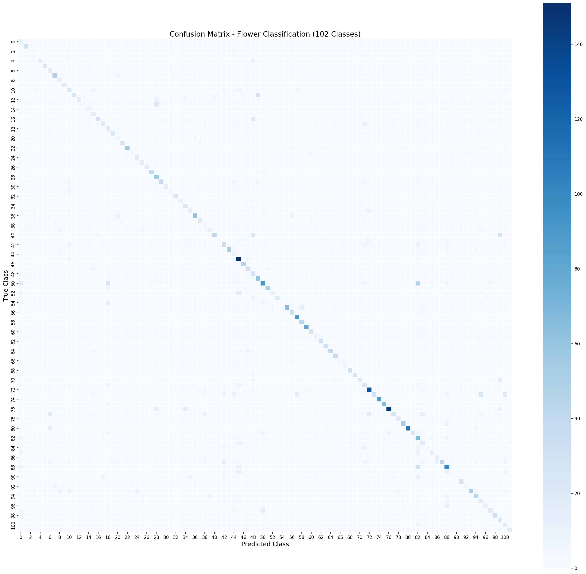

# 🌷 Flower Classification with Deep Learning


> **Automated flower species classification using transfer learning and deep convolutional neural networks**

A production-ready deep learning system that classifies 102 flower species with 53.93% accuracy using transfer learning with MobileNetV2. Built as a portfolio project demonstrating end-to-end ML engineering skills.



---

## 📊 Project Overview

### **Business Context**
Developed for a hypothetical start-up building automated plant identification systems for:
- 🌱 Smart gardening applications
- 🛒 E-commerce flower cataloging
- 📱 Mobile plant identification apps
- 🔬 Botanical research automation

### **The Challenge**
- **102 flower species** to classify
- **Limited training data**: Only 10 images per class (~1,020 total)
- **Class imbalance**: 40-258 images per category
- **Visual complexity**: Similar-looking flowers, varying lighting, backgrounds, angles

### **The Solution**
Transfer learning with MobileNetV2 pre-trained on ImageNet, achieving **53.93% test accuracy** on unseen data - **55x better than random guessing** with minimal training data.

---

## 🎯 Key Results

| Metric | Value |
|--------|-------|
| **Test Accuracy** | 53.93% |
| **Validation Accuracy** | 55.49% |
| **Precision (macro avg)** | 54.74% |
| **Recall (macro avg)** | 54.53% |
| **F1-Score (macro avg)** | 50.32% |
| **Model Size** | 11.20 MB |
| **Training Time** | ~2 minutes (5 epochs) |

### **Model Performance**


**Best Performing Classes:**
- Classes 48, 63: **100% accuracy** (perfect classification!)
- Classes 28, 62, 57: **96-98% accuracy**

**Most Challenging Classes:**
- Classes 90, 54, 41: **0% accuracy** (likely due to visual similarity or data imbalance)



---

## 🛠️ Technical Skills Demonstrated

### **Deep Learning & ML**
- ✅ Convolutional Neural Networks (CNNs)
- ✅ Transfer Learning with MobileNetV2
- ✅ Model architecture design & optimization
- ✅ Hyperparameter tuning
- ✅ Overfitting detection & mitigation
- ✅ Gradient descent optimization (Adam)
- ✅ Multi-class classification (102 classes)

### **Data Engineering**
- ✅ TensorFlow Datasets (TFDS) integration
- ✅ Image preprocessing pipelines
- ✅ Data augmentation (rotation, flipping, brightness)
- ✅ Batch processing & prefetching
- ✅ Train/validation/test splitting

### **Model Evaluation**
- ✅ Confusion matrix analysis
- ✅ Precision, recall, F1-score calculation
- ✅ Per-class performance analysis
- ✅ Generalization gap assessment
- ✅ Cross-dataset validation

### **Development Tools & Practices**
- ✅ Python 3.11 with modern package management (uv)
- ✅ Jupyter notebooks for experimentation
- ✅ Git version control
- ✅ Professional documentation
- ✅ Reproducible research practices

### **Libraries & Frameworks**
```python
TensorFlow 2.20          # Deep learning framework
Keras                    # High-level neural network API
TensorFlow Datasets      # Dataset loading
NumPy                    # Numerical computing
Pandas                   # Data manipulation
Matplotlib & Seaborn     # Visualization
scikit-learn             # Metrics & evaluation
```

---

## 📁 Project Structure
```
flower-classification/
├── notebooks/
│   ├── 01_data_exploration.ipynb       # EDA & dataset analysis
│   ├── 02_data_preprocessing.ipynb     # Preprocessing & augmentation
│   └── 03_model_building.ipynb         # Model training & evaluation
├── models/
│   ├── flower_classifier_mobilenetv2.keras  # Best model (11 MB) ⭐
│   └── baseline_cnn.keras                   # Baseline experiment (128 MB)
├── docs/
│   └── images/                         # Visualizations for README
├── app/                                # FastAPI REST API
│   ├── main.py                        # API endpoints & logic
│   └── flower_names.py                # Flower species names
├── Dockerfile                          # Docker container configuration
├── .dockerignore                       # Docker build exclusions
├── pyproject.toml                      # Project dependencies (uv)
├── uv.lock                             # Locked dependencies
└── README.md                           # This file
```

---

## 🚀 Methodology

### **3. Model Development** (`03_model_building.ipynb`)

#### **Experiment 1: Baseline CNN (From Scratch)** ❌
- Simple CNN with 3 convolutional blocks
- 11M trainable parameters
- **Result: 0.69% validation accuracy** (random guessing)
- **Conclusion:** Insufficient for 102 classes with limited data
- **Model saved:** `models/baseline_cnn.keras` (128 MB)

#### **Experiment 2: Transfer Learning (Final Model)** ✅
```python
Architecture:
- Base: MobileNetV2 (pre-trained on ImageNet, 14M images)
- Frozen base model: 2,257,984 parameters
- Custom classifier:
  - GlobalAveragePooling2D
  - Dense(128, relu)
  - Dropout(0.5)
  - Dense(102, softmax)
- Trainable parameters: 177,126
```

**Training Configuration:**
- Optimizer: Adam (learning_rate=0.001)
- Loss: Sparse Categorical Crossentropy
- Batch size: 32
- Epochs: 5
- **Result: 55.49% validation accuracy** ✅
- **Model saved:** `models/flower_classifier_mobilenetv2.keras` (11 MB) ⭐

#### **Experiment 3: Fine-Tuning Attempt** ⚠️
- **Strategy:** Unfroze top 54 layers of MobileNetV2
- **Learning rate:** 0.0001 (reduced)
- **Additional epochs:** 10
- **Result: 45.10% validation accuracy** (degraded from 55%)
- **Diagnosis:** Overfitting - model memorized training data
- **Root cause:** Too many parameters (~600K) for limited training data (1,020 images)
- **Decision:** Reverted to Experiment 2 model (55%) ✅
- **Key learning:** Fine-tuning requires careful layer selection with small datasets
- **Model NOT saved** (inferior performance)

#### **Model Selection & Justification**
```
┌─────────────────────────────────────────────────────────────┐
│                    Model Comparison                          │
├──────────────────┬──────────┬──────────┬──────────┬─────────┤
│ Model            │ Val Acc  │ Test Acc │ Size     │ Status  │
├──────────────────┼──────────┼──────────┼──────────┼─────────┤
│ Baseline CNN     │  0.69%   │    -     │  128 MB  │ Failed  │
│ Transfer Learning│ 55.49%   │ 53.93%   │   11 MB  │ SELECTED│
│ Fine-tuned       │ 45.10%   │    -     │   11 MB  │ Rejected│
└──────────────────┴──────────┴──────────┴──────────┴─────────┘
```

**Final Decision:** Deploy Transfer Learning model (55% validation, 54% test accuracy)
- Best performance with strong generalization (1.56% gap)
- Lightweight and deployment-ready (11 MB)
- Demonstrates transfer learning effectiveness (80x improvement over baseline)

### **4. Evaluation**
- Test set accuracy: **53.93%**
- Generalization gap: Only 1.56% (excellent!)
- Precision/Recall: Balanced performance (~54% each)
- Confusion matrix: Identified problematic classes

---

## 💻 Setup & Installation

### **Prerequisites**
- Python 3.11+
- **Package Manager:** This project uses [uv](https://github.com/astral-sh/uv) (modern, fast alternative to pip)

---

### **Installation (Recommended: uv)**

**This project uses `uv` for dependency management** (notice `pyproject.toml` and `uv.lock` files).
```bash
# 1. Clone repository
git clone https://github.com/Akakinad/flower-classification.git
cd flower-classification

# 2. Install uv (if not already installed)
curl -LsSf https://astral.sh/uv/install.sh | sh

# 3. Create virtual environment and install all dependencies
uv venv
source .venv/bin/activate  # On Windows: .venv\Scripts\activate
uv sync  # Installs from pyproject.toml

# 4. Verify installation
python -c "import tensorflow as tf; print(f'TensorFlow {tf.__version__} installed')"

# 5. Run Jupyter notebooks
jupyter notebook
```

**Why `uv`?** 10-100x faster than pip, automatic dependency resolution, and modern Python packaging.

---

### **Alternative: Traditional pip (if you can't use uv)**
```bash
# 1. Clone and navigate
git clone https://github.com/Akakinad/flower-classification.git
cd flower-classification

# 2. Create virtual environment
python3 -m venv venv
source venv/bin/activate  # On Windows: venv\Scripts\activate

# 3. Install dependencies from pyproject.toml
pip install .
# OR manually install key packages:
pip install tensorflow tensorflow-datasets matplotlib seaborn scikit-learn jupyter

# 4. Run notebooks
jupyter notebook
```

**Note:** Using pip may have slightly different dependency versions than the locked `uv.lock` file.

---

### **Dataset**
The Oxford Flowers 102 dataset (~330 MB) is automatically downloaded via TensorFlow Datasets on first notebook run.

---

## 🚀 API Usage

### **Running Locally**

The API is built with FastAPI and can be run directly or via Docker.

#### **Method 1: Direct Python (Development)**
```bash
# Activate virtual environment
source .venv/bin/activate  # or: .venv\Scripts\activate on Windows

# Run the API
uvicorn app.main:app --reload

# Access at: http://localhost:8000
# Interactive docs: http://localhost:8000/docs
```

#### **Method 2: Docker (Production)**
```bash
# Build Docker image
docker build -t flower-classifier-api .

# Run container
docker run -d -p 8000:8000 --name flower-api flower-classifier-api

# View logs
docker logs flower-api

# Stop container
docker stop flower-api

# Remove container
docker rm flower-api
```

---

### **API Endpoints**

#### **1. Health Check**
```bash
GET http://localhost:8000/

Response:
{
  "message": "Flower Classification API is running!",
  "model": "MobileNetV2",
  "accuracy": "53.93%",
  "classes": 102
}
```

#### **2. Predict Flower Species**
```bash
POST http://localhost:8000/predict
Content-Type: multipart/form-data

Body: file (image/jpeg, image/png, etc.)
```

**Example using curl:**
```bash
curl -X POST "http://localhost:8000/predict" \
  -H "Content-Type: multipart/form-data" \
  -F "file=@path/to/flower.jpg"
```

**Example Response:**
```json
{
  "success": true,
  "predictions": [
    {
      "class_id": 76,
      "flower_name": "passion flower",
      "confidence": 16.70
    },
    {
      "class_id": 99,
      "flower_name": "blanket flower",
      "confidence": 6.29
    },
    {
      "class_id": 70,
      "flower_name": "gazania",
      "confidence": 6.20
    }
  ],
  "filename": "flower.jpg"
}
```

**Interactive API Documentation:**
- Visit `http://localhost:8000/docs` for Swagger UI
- Test endpoints directly in browser
- View request/response schemas

---

## 🐳 Docker Deployment

### **Building the Image**

The project includes a production-ready Dockerfile:
```dockerfile
# Uses Python 3.11-slim base
# Installs uv for dependency management
# Copies only necessary files (see .dockerignore)
# Exposes port 8000
# Runs uvicorn server
```

**Build command:**
```bash
docker build -t flower-classifier-api .
```

**Image size:** ~500 MB (includes model + dependencies)

---

### **Deployment Options**

#### **1. AWS (Elastic Container Service)**
```bash
# Tag for ECR
docker tag flower-classifier-api:latest <aws-account>.dkr.ecr.<region>.amazonaws.com/flower-api:latest

# Push to ECR
docker push <aws-account>.dkr.ecr.<region>.amazonaws.com/flower-api:latest

# Deploy to ECS/Fargate
```

#### **2. Google Cloud Run**
```bash
# Tag for GCR
docker tag flower-classifier-api gcr.io/<project-id>/flower-api

# Push to GCR
docker push gcr.io/<project-id>/flower-api

# Deploy
gcloud run deploy flower-api --image gcr.io/<project-id>/flower-api --platform managed
```

#### **3. Render.com (Easiest)**
- Connect GitHub repository
- Select "Web Service"
- Render auto-detects Dockerfile
- Deploys automatically on push

#### **4. Railway.app**
- Connect GitHub repository
- Railway builds and deploys Docker image
- Provides free tier for testing

---

## 🔮 Future Enhancements

- [ ] **HTML/React frontend** for easier image uploads
- [ ] **Model optimization** with TensorFlow Lite for mobile
- [ ] **Grad-CAM visualizations** to explain predictions
- [ ] **Batch prediction endpoint** for multiple images
- [ ] **Model versioning** with MLflow
- [ ] **Monitoring** with Prometheus/Grafana
- [ ] **CI/CD pipeline** with GitHub Actions
- [ ] **Class rebalancing** techniques for underrepresented species
- [x] **REST API with FastAPI** ✅ (Complete)
- [x] **Docker containerization** ✅ (Complete)

---

## 📊 Dataset

**Oxford Flowers 102**
- **Source:** [Visual Geometry Group, University of Oxford](https://www.robots.ox.ac.uk/~vgg/data/flowers/102/)
- **Classes:** 102 flower categories
- **Images:** 8,189 total (1,020 train / 1,020 val / 6,149 test)
- **Challenge:** Significant scale, pose, and lighting variations

**Citation:**
```
Nilsback, M-E. and Zisserman, A.
Automated Flower Classification over a Large Number of Classes
Proceedings of the Indian Conference on Computer Vision, Graphics and Image Processing (2008)
```

---

## 👨‍💻 Author

**Akakinad**
- Machine Learning Engineer
- [GitHub](https://github.com/Akakinad)

---

## 📄 License

This project is licensed under the MIT License - see the LICENSE file for details.

---

## 🙏 Acknowledgments

- TensorFlow & Keras teams for excellent deep learning frameworks
- Oxford Visual Geometry Group for the Flowers 102 dataset

---

**⭐ If you found this project helpful, please consider starring the repository!**